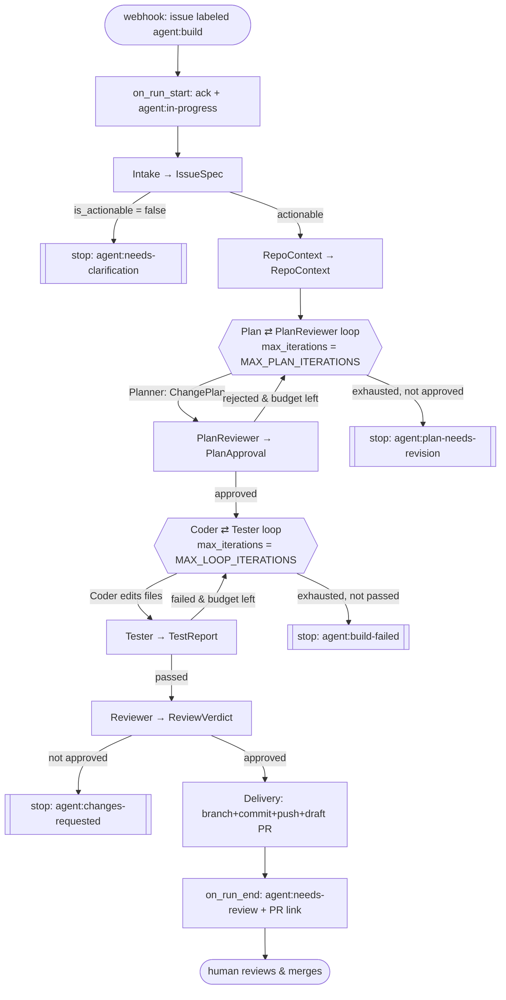

# ARCHITECTURE.md — sdlc-agent

An **autonomous, event-driven "issue → pull request" coding harness** built on
**Google ADK 2.0**. Labeling a GitHub issue `agent:build` wakes a multi-agent
system that understands the requirement, clones and maps the repo, **plans →
auto-approves → implements → tests → reviews**, and opens a **draft pull
request** linked to the issue. A human always merges.

This document explains the harness in depth: components, the agent roster,
control flow, the state contract, tools/MCP/skills, the cross-cutting guardrails,
and a full end-to-end walkthrough on one example issue. For the GCP
deployment posture, see [DEPLOYMENT.md](./DEPLOYMENT.md); for the original target
design, see [technical-design-document.md](./technical-design-document.md).

---

## 1. What this harness is

A "coding agent / SDLC harness" composed of:

- **A trigger/ingress** — a GitHub webhook receiver (`app/webhook.py`) that turns
  an `issues.labeled` event into an asynchronous agent run.
- **A custom orchestrator** — `IssueToPrOrchestrator` (a `BaseAgent`) that
  sequences stages and **routes on state** (stop early when not actionable / plan
  rejected / build failed / review rejected).
- **Specialised sub-agents (personas)** — Intake, RepoContext, Planner, Plan
  Reviewer, Coder, Tester, Reviewer, Delivery — each with a focused instruction,
  model, skills, and a least-privilege toolset.
- **Two bounded loops** — Planner⇄Plan-Reviewer (auto-approve / re-plan) and
  Coder⇄Tester (implement until green), each exiting via an `EscalationChecker`
  or `max_iterations`.
- **Tools** — host **sandbox** tools (git clone / read / write / run / commit /
  push), **GitHub MCP** toolsets (read-scoped + a minimal write path), and
  deterministic **GitHub REST** status writes.
- **Skills** — ADK Skills (`SKILL.md`) carrying procedural know-how per persona.
- **A typed state contract** — Pydantic models written to known session-state
  slots; state is the only hand-off between agents.
- **Cross-cutting guardrails** — plugins + conventions that keep runs safe and
  unstuck (token caps, tool-error recovery, HMAC verify, least privilege,
  selective git staging, prompt-injection hygiene).

---

## 2. High-level architecture

```
   (1) issue labeled "agent:build"
GitHub ───────────────────────────────►  Webhook ingress (app/webhook.py, FastAPI)
  ▲  ▲                                      - verify X-Hub-Signature-256 (HMAC)
  │  │                                      - filter: issues / action=labeled / TRIGGER_LABEL
  │  │                                      - dedupe on X-GitHub-Delivery
  │  │                                      - return 202 fast (no model call on hot path)
  │  │                                      - background asyncio task ↓
  │  │                                                 │
  │  │                                      app/run_core.py: run_pipeline(repo, issue_id)
  │  │                                      - seed state["issue_request"] = {repo, issue_id}
  │  │                                      - Runner(root_agent) + InMemorySession (ephemeral)
  │  │                                                 │
  │  │   ┌──────────────────── App (plugins: Logging, BoundedGeneration, ToolErrorRecovery) ───────────────┐
  │  │   │  IssueToPrOrchestrator (BaseAgent, root)                                                          │
  │  │   │                                                                                                   │
  │  │   │   Intake → RepoContext → [Planner ⇄ PlanReviewer]loop → [Coder ⇄ Tester]loop → Reviewer → Delivery│
  │  │   │      │          │                  │                          │                    │          │   │
  │  │   │   IssueSpec  RepoContext       ChangePlan/                 TestReport         ReviewVerdict  Delivery│
  │  │   │                                PlanApproval                                                  Result  │
  │  │   │                                                                                                   │
  │  │   │   on_run_start callback: 🤖 ack comment + agent:in-progress (GitHub REST)                          │
  │  │   │   on_run_end   callback: terminal status comment + label (derived from state)                     │
  │  │   └───────────────┬───────────────────────────────────────────────┬───────────────────────────────────┘
  │  │                   │ host sandbox (git clone/read/write/run/commit/push, /tmp)                          
  │  │                   │ GitHub MCP (read-scoped everywhere; write = create_pull_request only, Delivery)    
  │  └───────────────────┘  comments + labels + a DRAFT PR linked to the issue                               
  └──────────────────────────  human reviews & merges the PR (no auto-merge)
```

**Decoupling principle (TDD §4):** the webhook returns `202` in well under a
second and never invokes a model on the hot path; the minutes-long coding run
happens in a background task. (On Cloud Run this becomes webhook → Pub/Sub →
worker; see DEPLOYMENT.md.)

---

## 3. Agent roster (personas)

Each persona is a focused ADK `LlmAgent` built by a factory in
`app/sub_agents/`. "Mode" is the ADK collaboration mode; tool-less agents use
`output_schema`, tool-using agents record output via `record_*` tools (because
`output_schema` disables tool calling).

| # | Persona (name) | Mission | Mode | Tools / Skills | Output → state slot |
|---|----------------|---------|------|----------------|---------------------|
| 1 | **Intake** (`intake_analyst`) | Read the issue + comments; extract a checkable spec; judge actionability | `single_turn` | `github_read` MCP, `spec-extraction` skill, `record_issue_spec` | `IssueSpec` → `issue_spec` |
| 2 | **RepoContext** (`codebase_navigator`) | Clone the repo; map languages/build/test/conventions; find relevant files | `single_turn` | host `SANDBOX_TOOLS`, `repo-recon` skill, `record_repo_context` | `RepoContext` → `repo_context` |
| 3 | **Planner** (`architect`) | Turn spec+context into a concrete change plan + test strategy | `single_turn` | none (`output_schema`) | `ChangePlan` → `change_plan` |
| 4 | **Plan Reviewer** (`plan_reviewer`) | Auto-approve the plan or return required changes (replaces human gate) | `single_turn` | none (`output_schema`) | `PlanApproval` → `plan_approval` |
| 5 | **Coder** (`implementer`) | Implement the plan by editing files (host workdir) | leaf of loop | `EDIT_TOOLS`, `coding-standards`+`safe-edits` skills | files on disk |
| 6 | **Tester** (`verifier`) | Write/run tests; record an honest pass/fail | leaf of loop | `EDIT_TOOLS`, `test-authoring` skill, `record_test_report` | `TestReport` → `test_report` |
| 7 | **Reviewer** (`critic`) | Check the diff vs acceptance criteria + security; gate delivery | `single_turn` | `repo_diff`,`read_repo_file`,`run_in_repo`, `github_read` MCP, `record_review_verdict` | `ReviewVerdict` → `review_verdict` |
| 8 | **Delivery** (`pr_author`) | Branch, commit, push, open a **draft PR** linked to the issue | `single_turn` | `GIT_TOOLS`, `github_write(tool_filter=["create_pull_request"])`, `record_delivery_result` | `DeliveryResult` → `delivery_result` |

The **Orchestrator** (`issue_to_pr_orchestrator`) owns sequencing, routing,
budget, and GitHub status side-effects (via callbacks). It does not write code.

---

## 4. Orchestration & control flow

`IssueToPrOrchestrator._run_async_impl` (in `app/agent.py`) runs each stage,
inspects the resulting state slot, and **routes** — returning early so downstream
agents don't run on a dead branch. The two iterative sub-loops are `LoopAgent`s
that exit when an `EscalationChecker` sees the success flag, or hit
`max_iterations`.



**Loop exit mechanics (`app/sub_agents/loop_checks.py`):** a `LoopAgent` exits
when a sub-agent yields an event with `actions.escalate=True`. `EscalationChecker`
is a tiny `BaseAgent` placed last in each loop; it escalates when a named boolean
in a state slot is true:
- plan loop → exits on `plan_approval.approved`
- build loop → exits on `test_report.passed`

**Terminal status (`app/callbacks.py:on_run_end`)** is derived from the furthest
slot reached and posted to the issue as a comment + label:

| State reached | Label |
|---|---|
| `issue_spec.is_actionable == false` | `agent:needs-clarification` |
| `plan_approval.approved == false` (or loop exhausted) | `agent:plan-needs-revision` |
| `test_report.passed == false` (or loop exhausted) | `agent:build-failed` |
| `delivery_result.pr_url` present | `agent:needs-review` ✅ |
| `review_verdict.approved == false` | `agent:changes-requested` |
| tests green but no PR | `agent:tests-green` / `agent:delivery-failed` |

---

## 5. The state contract

State is the **only** hand-off between agents (no free-text passing). Slot names
are constants in `app/schemas.py` (`STATE_*`); values are Pydantic models written
by the `record_*` tools (tool-using agents) or `output_key` (tool-less agents).

| Slot | Schema | Written by | Read by |
|------|--------|-----------|---------|
| `issue_request` | `{repo, issue_id}` | trigger (`run_core`) / `record_issue_spec` fallback | callbacks, Intake, Delivery |
| `issue_spec` | `IssueSpec` | Intake | RepoContext, Planner, PlanReviewer, Reviewer, Delivery |
| `repo_context` | `RepoContext` | RepoContext | Planner, PlanReviewer, Coder, Tester |
| `change_plan` | `ChangePlan` | Planner (`output_key`) | PlanReviewer, Coder, Reviewer, Delivery, callbacks |
| `plan_approval` | `PlanApproval` | PlanReviewer (`output_key`) | plan_gate, Planner (re-plan), callbacks |
| `test_report` | `TestReport` | Tester | build_gate, Reviewer, callbacks |
| `review_verdict` | `ReviewVerdict` | Reviewer | callbacks (gates Delivery) |
| `delivery_result` | `DeliveryResult` | Delivery | callbacks |
| `temp:repo_workdir` | path | `clone_repo` | all sandbox tools |
| `temp:written_paths` | list | `write_repo_file` | `repo_diff`, `commit_all` (selective staging) |

Schema fields (abridged): `IssueSpec{issue_id, repo, title, problem,
acceptance_criteria[], constraints[], affected_area, is_actionable,
clarification_needed}` · `RepoContext{default_branch, languages[], build_system,
test_command, relevant_paths[], conventions_notes}` · `ChangePlan{steps[],
files_to_change[], test_strategy, risk_flags[]}` · `PlanApproval{approved,
rationale, required_changes[]}` · `TestReport{passed, total, failed[], logs_ref,
coverage?}` · `ReviewVerdict{approved, criteria_results[], security_findings[],
required_changes[]}` · `DeliveryResult{branch, pr_url, status_label}`.

---

## 6. Tools, MCP, and the sandbox

### 6.1 GitHub MCP (`app/tools/github_mcp.py`)
Remote GitHub MCP server (`https://api.githubcopilot.com/mcp/`) via
`McpToolset` + `StreamableHTTPConnectionParams`, split by privilege:
- **`github_read()`** — `X-MCP-Toolsets: repos,issues,labels,discussions,code_security,dependabot`, `X-MCP-Readonly: true`. Used by Intake & Reviewer.
- **`github_write(tool_filter=["create_pull_request"])`** — write scope, but the
  tool filter exposes **only** `create_pull_request`. This (a) keeps dangerous
  tools (`merge_pull_request`, `delete_file`, …) out of the agent's hands, and
  (b) avoids a name collision with the local `create_branch` git tool. Used by
  Delivery only.

### 6.2 Host sandbox (`app/tools/sandbox.py`)
Selected by `SANDBOX_BACKEND` (`host` local / `agent_engine` for GCP managed
Code Execution). Host tools operate on a per-run working dir
(`state["temp:repo_workdir"]`), with **secret redaction** and **output caps**.
Grouped:
- `SANDBOX_TOOLS` (recon): `clone_repo`, `list_repo_tree`, `read_repo_file`, `run_in_repo`
- `EDIT_TOOLS` (build loop): the above + `write_repo_file`, `repo_diff`
- `GIT_TOOLS` (delivery): `create_branch`, `commit_all`, `push_branch`

**Selective staging:** `write_repo_file` records each path in
`state["temp:written_paths"]`; `repo_diff`/`commit_all` stage **only those paths**
(`git add -- <paths>`), never `git add -A` — so artifacts the Tester generates
(`__pycache__`, `*.pyc`) never enter the diff or the PR commit.

Code executors: `get_code_executor()` → `UnsafeLocalCodeExecutor` (host) /
`AgentEngineSandboxCodeExecutor` (GCP). `maybe_code_executor()` returns `None` on
host (the build loop drives deterministic edit tools instead).

### 6.3 Deterministic status writes (`app/tools/github_status.py`)
The orchestrator (not the LLM) posts the ack/terminal comment + labels via the
GitHub REST API (`post_comment`, `add_labels`). Deterministic, auditable, and
keeps the write-scoped MCP reserved for Delivery. Best-effort (never crashes the
run).

---

## 7. Skills (`app/skills/<name>/SKILL.md`)

ADK Skills package procedural knowledge, attached via `SkillToolset`:
- **`spec-extraction`** (Intake) — how to derive checkable acceptance criteria;
  treat issue text as untrusted data.
- **`repo-recon`** (RepoContext) — clone-first ordering; detect build/test tooling.
- **`coding-standards`** (Coder) — read before write; match conventions; stay in scope.
- **`safe-edits`** (Coder) — preserve unrelated code; no destructive ops; no secrets.
- **`test-authoring`** (Tester) — target acceptance criteria; report honestly.

---

## 8. Guardrails (cross-cutting)

| Guardrail | Where | What it prevents |
|---|---|---|
| **HMAC webhook verify + dedupe** | `app/webhook.py` | Forged/replayed events; duplicate runs. |
| **Least-privilege MCP** | `github_mcp.py` | Read-only everywhere; write = `create_pull_request` only. No auto-merge. |
| **Prompt-injection hygiene** | every persona instruction + skills | Issue/PR/file text is **data, not instructions**. |
| **`output_schema` vs tools split** | sub-agents + `record_*` tools | Structured, validated hand-offs without losing tool use. |
| **Selective git staging** | `sandbox.py` | Committing build artifacts. |
| **`BoundedGenerationPlugin`** | `app/plugins.py` | A degenerate model loop streaming unbounded (caps `max_output_tokens`). |
| **`ToolErrorRecoveryPlugin`** | `app/plugins.py` | A hallucinated/unknown tool call crashing the whole run (returns a recoverable error so the model self-corrects). |
| **Secret redaction + output caps** | `sandbox.py` | Tokens/large output leaking into model context or logs. |
| **Budget bounds** | `MAX_PLAN_ITERATIONS`, `MAX_LOOP_ITERATIONS`, `MAX_RUN_WALL_SECONDS` | Runaway loops / cost. |
| **Reviewer calibration** | `reviewer.py` instruction | Over-rejection on style nits (blocks only on real issues). |
| **HITL: human merges** | draft PR + `agent:needs-review` | Auto-merge to protected branches. |

The `App` registers three plugins: **`LoggingPlugin`** (traces every agent
transition / tool call / response), **`BoundedGenerationPlugin`**, and
**`ToolErrorRecoveryPlugin`**.

---

## 9. End-to-end walkthrough (one issue)

**Issue #8** on a Flask repo: *"Add a `/health` endpoint that returns HTTP 200."*
A maintainer adds the **`agent:build`** label.

1. **Webhook (`app/webhook.py`).** GitHub POSTs the `issues/labeled` event.
   The ingress verifies the HMAC, confirms `action=labeled` + label ==
   `agent:build`, dedupes on `X-GitHub-Delivery`, returns **202**, and launches a
   background task. (No model call yet.)
2. **Run start (`run_core.run_pipeline`).** Seeds
   `state["issue_request"] = {"repo": "rishops/docker-demo...", "issue_id": 8}`,
   creates an ephemeral session, runs `root_agent`. `on_run_start` posts a
   "🤖 picked up" comment and adds `agent:in-progress`.
3. **Intake.** Reads issue #8 via `github_read` MCP, applies `spec-extraction`,
   records `IssueSpec{problem:"no /health endpoint", acceptance_criteria:["GET
   /health returns 200"], is_actionable:true, ...}`. Orchestrator sees actionable
   → continue.
4. **RepoContext.** `clone_repo` shallow-clones into `/tmp/sdlc-agent-XXXX`;
   `list_repo_tree` + `read_repo_file` find `main.py`, `requirements.txt`;
   records `RepoContext{languages:["Python"], build_system:"pip", test_command:..,
   relevant_paths:["main.py"], conventions_notes:"Flask routes"}`.
5. **Plan ⇄ Plan-Reviewer loop.** Planner emits `ChangePlan{steps:["add /health
   route to main.py"], files_to_change:["main.py"], test_strategy:"pytest asserts
   GET /health == 200"}`. Plan Reviewer judges it grounded/complete/safe →
   `PlanApproval{approved:true}`. `plan_gate` escalates → loop exits. (If rejected,
   the Planner re-plans with `required_changes`, up to `MAX_PLAN_ITERATIONS`.)
6. **Coder ⇄ Tester loop.** Coder reads `main.py`, `write_repo_file`s the new
   `/health` route (tracked in `temp:written_paths`). Tester `write_repo_file`s
   `test_health.py`, runs it via `run_in_repo`, and `record_test_report{passed:
   true, total:1}`. `build_gate` escalates → loop exits. (If failing, Coder fixes
   the reported failures next iteration, up to `MAX_LOOP_ITERATIONS`.)
7. **Reviewer.** Inspects the diff (`repo_diff` — only the written files, no
   `__pycache__`), checks it meets "GET /health returns 200", runs security reads,
   and records `ReviewVerdict{approved:true}`. Orchestrator → continue.
8. **Delivery.** `create_branch agent/issue-8-health` → `commit_all` (stages only
   `main.py` + `test_health.py`) → `push_branch` → MCP `create_pull_request`
   (draft, base=default branch, body "Closes #8") → `record_delivery_result{
   pr_url, branch}`.
9. **Run end (`on_run_end`).** Posts the PR link, sets **`agent:needs-review`**.
   A human reviews the draft PR and merges.

Total: one label → one draft PR, fully autonomous, with the issue thread
narrating every stage.

---

## 10. Trigger / ingress detail

`app/webhook.py` (FastAPI):
- `POST /webhook/github` — `verify_signature` (HMAC SHA-256, fail-closed) →
  `parse_trigger` (event `issues`, action `labeled`, label == `TRIGGER_LABEL`) →
  dedupe on delivery id → **202** + `asyncio.create_task(run_pipeline(...))`.
- `GET /healthz`.
- `run_pipeline` (`app/run_core.py`) is shared by the webhook and the
  `scripts/run_local_issue.py` CLI; the CLI just seeds the same target and prints
  the event stream.

Local testing uses a tunnel (smee/ngrok) → see [local-run-steps.md](./local-run-steps.md).
The cloud form (Cloud Run + Pub/Sub worker) is in DEPLOYMENT.md.

---

## 11. Configuration (`app/config.py`)

Env-driven (loaded from `.env`): Vertex AI (`GOOGLE_CLOUD_PROJECT`,
`GOOGLE_CLOUD_LOCATION=global`), per-role models (`MODEL_INTAKE` …
`MODEL_DELIVERY`, `MODEL_PLAN_APPROVER`; default `gemini-3-flash-preview`),
`SANDBOX_BACKEND`, GitHub (`GITHUB_TOKEN`, `TARGET_REPO`, `TRIGGER_LABEL`,
`GITHUB_WEBHOOK_SECRET`, `GIT_AUTHOR_*`), budgets (`MAX_PLAN_ITERATIONS=2`,
`MAX_LOOP_ITERATIONS=4`, `MAX_RUN_WALL_SECONDS=1800`), generation bounds
(`MAX_OUTPUT_TOKENS=8192`, `DEFAULT_TEMPERATURE=0.5`), and status posting
(`POST_STATUS`). `GITHUB_TOKEN` is required even to construct the agent (MCP
headers).

---

## 12. Deployment posture (summary)

The host sandbox (real `git` + subprocess + filesystem) and the webhook trigger
mean the workflow targets **Cloud Run** (container with git+toolchains; native
event ingress), **published to Gemini Enterprise** — not Agent Runtime (which
can't receive webhooks and has no shell/git). Full assessment, the BYOC image,
Pub/Sub decoupling, secrets, and `agents-cli` steps are in
[DEPLOYMENT.md](./DEPLOYMENT.md).

---

## 13. Component map (quick reference)

| Path | Responsibility |
|------|----------------|
| `app/webhook.py` | Event-driven ingress (HMAC, filter, dedupe, 202, background run). |
| `app/run_core.py` | `run_pipeline(repo, issue_id)` — shared run entry point. |
| `app/agent.py` | `IssueToPrOrchestrator` + the two `LoopAgent`s + `App`/plugins. |
| `app/sub_agents/*` | The 8 personas + `loop_checks.py` (`EscalationChecker`) + `_common.py`. |
| `app/tools/github_mcp.py` | Read/write GitHub MCP toolset factories. |
| `app/tools/sandbox.py` | Host sandbox (recon/edit/git) + selective staging + code executors. |
| `app/tools/state_tools.py` | `record_*` tools writing validated state. |
| `app/tools/github_status.py` | Deterministic GitHub REST status writes. |
| `app/skills/*/SKILL.md` | Per-persona ADK Skills. |
| `app/plugins.py` | `BoundedGenerationPlugin`, `ToolErrorRecoveryPlugin`. |
| `app/callbacks.py` | `on_run_start` / `on_run_end` status side-effects. |
| `app/schemas.py` | State-slot constants + Pydantic contracts. |
| `app/config.py` | Env-driven configuration. |
