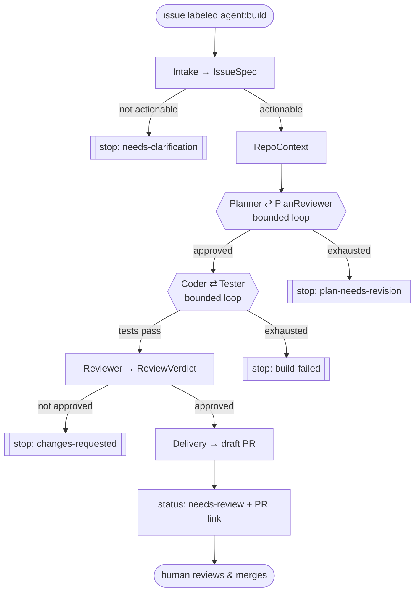

# sdlc-agent

**Autonomous "issue → pull request" multi-agent workflow, built on Google ADK 2.0.**

Label a GitHub issue `agent:build` and walk away. A multi-agent system wakes up,
understands the requirement, clones and maps the repo, **plans → auto-approves the
plan → implements → tests in a loop → reviews**, and opens a **draft pull request**
linked to the issue. A human always merges — no auto-merge, ever.

This is *async, ambient* AI engineering: you delegate to the agent the way you'd
delegate to a capable junior, and a reviewable artifact is waiting when you get back.

> **Current milestone: P3 — event-driven + deploy.** The workflow runs end-to-end
> locally, triggered by a real GitHub webhook (via a tunnel). Cloud Run + Gemini
> Enterprise deployment is staged — see [DEPLOYMENT.md](./DEPLOYMENT.md).

---

## What it does

- **Trigger:** a GitHub `issues.labeled` event (`agent:build`) — not a chat prompt.
- **Understands:** extracts a checkable spec (acceptance criteria, constraints) and
  decides if the issue is actionable.
- **Maps:** shallow-clones the repo into a sandbox; detects languages, build system,
  test command, and conventions.
- **Plans & self-approves:** a Planner proposes a change plan; a separate Plan
  Reviewer agent approves it or sends it back (bounded re-plan loop) — replacing the
  human plan-approval gate with an agentic one.
- **Builds & verifies:** a Coder ⇄ Tester loop implements the change and runs the
  suite until green (or a bounded failure).
- **Reviews & delivers:** a Reviewer checks the diff against the acceptance criteria
  and gates delivery; Delivery pushes a branch and opens a **draft PR** (`Closes #N`).
- **Human merges.** The one gate that matters stays human.

---

## Architecture at a glance

```
   (1) issue labeled "agent:build"
GitHub ─────────────────────────────►  Webhook ingress (app/webhook.py, FastAPI)
  ▲  ▲                                    • verify HMAC signature
  │  │                                    • filter: issues / labeled / trigger-label
  │  │                                    • dedupe on delivery-id
  │  │                                    • return 202 FAST (no model on the hot path)
  │  │                                    • run pipeline in a background task ↓
  │  │     ┌────────── App (plugins: Logging · BoundedGeneration · ToolErrorRecovery) ──────────┐
  │  │     │  IssueToPrOrchestrator  (custom BaseAgent — sequences + routes on state)            │
  │  │     │  Intake → RepoContext → [Planner ⇄ PlanReviewer] → [Coder ⇄ Tester] → Reviewer → Delivery
  │  │     └──────────────┬─────────────────────────────────────────────────────────┬───────────┘
  │  │                    │ host sandbox (git clone/read/write/run/commit/push)       │
  │  └────────────────────┘ GitHub MCP (read everywhere; write = create_pull_request) │
  └──────────────────────────  status comments + labels + a DRAFT PR ◄───────────────┘
                                human reviews & merges (no auto-merge, ever)
```

The pipeline is a **deterministic backbone** that routes on typed state; the LLM's
judgment lives *inside* each stage, not on the edges:



Deep dive: **[ARCHITECTURE.md](./ARCHITECTURE.md)**. Behavior contract:
**[DESIGN_SPEC.md](./DESIGN_SPEC.md)**.

### Agent roster

| Persona | Job | Key privilege |
|---|---|---|
| **Intake** | Issue → checkable spec; actionability | GitHub **read** |
| **RepoContext** | Clone + map the repo | sandbox (read) |
| **Planner** | Concrete change plan + test strategy | none (reasoning) |
| **Plan Reviewer** | Approve the plan or return required changes | none (reasoning) |
| **Coder** | Implement the plan (edit files) | sandbox (edit) |
| **Tester** | Write + run tests; report honestly | sandbox (edit + run) |
| **Reviewer** | Check diff vs criteria + security; gate delivery | sandbox + GitHub read |
| **Delivery** | Branch, commit, push, open **draft PR** | GitHub **write** (1 tool) |

---

## Repository structure

```
sdlc-agent/
├── app/
│   ├── agent.py            # IssueToPrOrchestrator (root) + the two LoopAgents + App/plugins
│   ├── webhook.py          # Event-driven ingress: POST /webhook/github (HMAC, filter, dedupe, 202)
│   ├── run_core.py         # run_pipeline(repo, issue_id) — shared by webhook + CLI
│   ├── plugins.py          # BoundedGenerationPlugin, ToolErrorRecoveryPlugin
│   ├── callbacks.py        # on_run_start / on_run_end status side-effects
│   ├── schemas.py          # Pydantic state contracts + STATE_* slot names
│   ├── config.py           # env-driven config (Vertex, models, sandbox, GitHub, budgets)
│   ├── sub_agents/         # one module per persona + loop_checks.py (EscalationChecker)
│   ├── tools/              # github_mcp.py, sandbox.py, state_tools.py, github_status.py
│   └── skills/             # ADK Skills (spec-extraction, repo-recon, coding-standards, ...)
├── scripts/run_local_issue.py   # CLI: run the pipeline on one issue
├── fixtures/issues/             # seeded issue targets
├── tests/                       # unit + integration (offline structural) + eval
├── ARCHITECTURE.md · DESIGN_SPEC.md · DEPLOYMENT.md · local-run-steps.md
└── technical-design-document.md · blog.md
```

---

## Requirements

- **[uv](https://docs.astral.sh/uv/getting-started/installation/)** — Python package manager (all deps go through it).
- **[Google Cloud SDK](https://cloud.google.com/sdk/docs/install)** + Vertex AI access — run `gcloud auth application-default login` and enable `aiplatform.googleapis.com`.
- **git** on your PATH — the sandbox clones/commits via the local `git`.
- **Node/npx** — only for the `smee-client` tunnel in the event-driven local run.
- **A fine-grained GitHub PAT** scoped to a throwaway **test repo**, with:
  **Metadata: Read** · **Contents: Read and Write** · **Issues: Read and Write** ·
  **Pull requests: Read and Write** (writes are needed once Delivery opens a real PR).

---

## Getting started locally

### 1. Install

```bash
make install          # or: uv sync
```

### 2. Configure `.env`

```bash
cp .env.example .env
```
Set at least:
```dotenv
GOOGLE_GENAI_USE_VERTEXAI=True
GOOGLE_CLOUD_PROJECT=your-gcp-project-id
GOOGLE_CLOUD_LOCATION=global

GITHUB_TOKEN=github_pat_xxx          # the fine-grained PAT
TARGET_REPO=your-user/your-test-repo
TRIGGER_LABEL=agent:build
GITHUB_WEBHOOK_SECRET=pick-a-long-random-string

SANDBOX_BACKEND=host
POST_STATUS=true
```
> `GITHUB_TOKEN` is required even to import the agent (it builds the MCP headers).

### 3. Run one issue — the quickest path (no webhook)

```bash
uv run python scripts/run_local_issue.py --repo your-user/your-test-repo --issue 1
# add --no-status to skip posting comments/labels
```
You'll see the event stream step through the pipeline and, on success, a **draft PR**
on the repo. This is the fastest way to validate creds + sandbox + the full flow.

### 4. Interactive Dev UI

```bash
make playground        # uv run adk web .  → select the "app" folder
```

---

## Event-driven run (GitHub webhook via smee)

Trigger the workflow the way it's meant to run — by **labeling an issue**, no chat.

```bash
# 1. Start the webhook server (logs the full run trace)
uv run uvicorn app.webhook:app --port 8080

# 2. Tunnel GitHub → localhost (new terminal)
npx smee-client --url https://smee.io/<your-channel> \
  --target http://localhost:8080/webhook/github

# 3. In the test repo → Settings → Webhooks → Add webhook:
#    Payload URL = the smee channel URL · Content type = application/json
#    Secret = GITHUB_WEBHOOK_SECRET · Events = "Issues" only

# 4. Create the `agent:build` label, then add it to an issue → draft PR appears.
```

The webhook verifies the HMAC signature, filters to `issues/labeled` on the trigger
label, dedupes on the delivery id, returns **202** instantly, and runs the pipeline in
the background. Full walkthrough + troubleshooting: **[local-run-steps.md](./local-run-steps.md)**.

---

## Commands

| Command | Description |
|---|---|
| `make install` | Install dependencies with uv |
| `make playground` | Launch the ADK Dev UI (`adk web .`) |
| `make test` | Run unit + integration (offline structural) tests |
| `make eval` | Run `adk eval` against `tests/eval/` (needs creds + a reachable issue) |
| `make lint` | ruff + ty + codespell |
| `uv run python scripts/run_local_issue.py --repo O/N --issue N` | Run the pipeline on one issue |
| `uv run uvicorn app.webhook:app --port 8080` | Start the event-driven webhook ingress |

---

## Configuration (`.env`)

| Variable | Purpose |
|---|---|
| `GOOGLE_CLOUD_PROJECT`, `GOOGLE_CLOUD_LOCATION=global`, `GOOGLE_GENAI_USE_VERTEXAI=True` | Vertex AI |
| `MODEL_*` (e.g. `MODEL_CODER`) | Per-role model override (default `gemini-3-flash-preview`) |
| `GITHUB_TOKEN`, `TARGET_REPO`, `TRIGGER_LABEL` | GitHub access + trigger |
| `GITHUB_WEBHOOK_SECRET` | HMAC secret for the webhook |
| `SANDBOX_BACKEND=host\|agent_engine` | Local host sandbox (offline) vs GCP managed |
| `MAX_PLAN_ITERATIONS`, `MAX_LOOP_ITERATIONS`, `MAX_OUTPUT_TOKENS` | Budget / loop / generation bounds |
| `POST_STATUS=true\|false` | Post GitHub comments/labels (set false for dry runs) |

See `.env.example` for the full list.

---

## Design highlights & guardrails

- **Deterministic backbone, intelligent nodes** — a custom `BaseAgent` orchestrator
  routes on typed state; LLMs reason inside stages.
- **State is the contract** — every hand-off is a validated Pydantic object in a known
  state slot, not free text.
- **Least-privilege tools** — read-only GitHub MCP everywhere; the write path is a
  single agent with a one-tool allow-list (`create_pull_request`).
- **Bounded loops** — Plan⇄Approve and Code⇄Test each exit on success or
  `max_iterations` (never "loop forever").
- **Guardrail plugins** — `BoundedGenerationPlugin` (caps runaway output),
  `ToolErrorRecoveryPlugin` (a hallucinated tool call becomes recoverable, not fatal).
- **Selective git staging** — only agent-written files are committed; build artifacts
  never pollute the PR.
- **Untrusted input** — issue/PR/file text is treated as data, never instructions.

More on each: **[ARCHITECTURE.md](./ARCHITECTURE.md)** (§8 Guardrails).

---

## Testing

```bash
make test     # unit + integration; offline and deterministic (no creds/network)
make eval     # adk eval — plan quality on a seeded issue (needs creds + a live issue)
```

---

## Deployment

The workflow targets **Cloud Run** (a container with `git` + toolchains so the host
sandbox works, plus native webhook ingress), **published to Gemini Enterprise** —
*not* Agent Runtime, which can't receive webhooks and has no shell/git. The webhook is
decoupled from long runs via **Pub/Sub → worker**.

Deployment is staged and requires explicit approval. Full GCP compatibility assessment,
the BYOC image, Pub/Sub decoupling, secrets, IAM/roles, and `agents-cli` steps are in
**[DEPLOYMENT.md](./DEPLOYMENT.md)**.

---

## Documentation

| Doc | What's in it |
|---|---|
| [ARCHITECTURE.md](./ARCHITECTURE.md) | Deep component + control-flow reference, diagrams, end-to-end walkthrough |
| [DESIGN_SPEC.md](./DESIGN_SPEC.md) | The behavior contract (milestones, personas, success criteria) |
| [DEPLOYMENT.md](./DEPLOYMENT.md) | Local→GCP compatibility matrix + Cloud Run / Gemini Enterprise steps |
| [local-run-steps.md](./local-run-steps.md) | Step-by-step event-driven local run (smee) + troubleshooting |
| [technical-design-document.md](./technical-design-document.md) | The original target architecture (TDD) |
| [blog.md](./blog.md) | Narrative write-up: building a reliable async multi-agent coding harness |

---

*Scaffolded with [`agent-starter-pack`](https://github.com/GoogleCloudPlatform/agent-starter-pack); the agent, orchestration, tools, and event-driven ingress are custom.*
